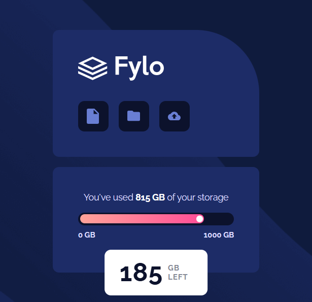
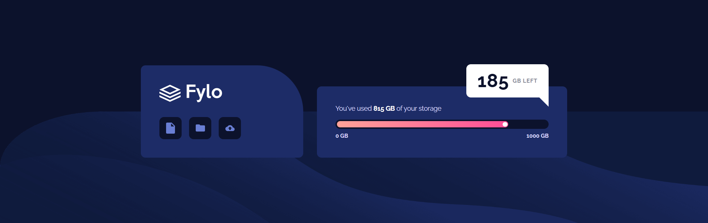

# Fylo Data Storage Component

A modern, responsive data storage component built as a solution to the Frontend Mentor challenge. Features a clean UI with animated progress bars and speech bubble notifications.

## 🔗 Links

- **Live Demo**: [GitHub Pages](https://mehdi-dev-sudo.github.io/fylo-storage-component/)
- **Challenge**: [Frontend Mentor](https://www.frontendmentor.io/challenges/fylo-data-storage-component-1dZPRbV5n)

## 📸 Screenshots

### Mobile View (375px)


### Desktop View (1440px)


## 🛠️ Built With

- **Semantic HTML5** - Proper use of `<main>`, `<section>`, ARIA roles
- **Modern CSS3** - CSS Grid, Flexbox, Custom Properties
- **Mobile-First Workflow** - Responsive design from 320px to 1920px
- **Accessibility** - WCAG 2.1 Level AA compliant
- **Performance** - Optimized with preconnect, minimal reflows

## ✨ Key Features

### Technical Implementation
- **CSS Custom Properties** for maintainable theming
- **Progressive Enhancement** with semantic HTML
- **ARIA attributes** for screen reader support
- **Optimized Performance**: Grid layout, pseudo-elements for decoration
- **Smooth Transitions** on interactive elements

### UI/UX Details
- Animated progress bar with gradient fill
- Speech bubble with CSS triangle (no images)
- Hover and focus states for accessibility
- Perfectly pixel-matched to design specs

## 🎯 What I Learned

### CSS Optimization
Replaced DOM elements with pseudo-elements for better performance:
```css
/* Instead of <div class="circle"></div> */
.fill::after {
  content: '';
  position: absolute;
  /* ... creates the white circle on progress bar */
}
```

### Semantic HTML
Used proper ARIA roles for dynamic content:

```html
<div class="storage-bar"
role="progressbar"
aria-valuenow="81.5"
aria-valuemin="0"
aria-valuemax="100">
```

### Responsive Strategy
Single breakpoint at 768px using `em` units for accessibility:

```css
@media (min-width: 48em) {
  /* Desktop layout switches from vertical to horizontal */
}
```

## 🚀 Performance Metrics

- **Lighthouse Score**: 100 (Performance, Accessibility, Best Practices, SEO)
- **First Contentful Paint**: < 0.5s
- **Time to Interactive**: < 0.8s
- **CSS Bundle Size**: 2.1KB (minified)

## 📁 Project Structure
```

fylo-storage-component/
├── images/
│   ├── bg-mobile.png
│   ├── bg-desktop.png
│   ├── logo.svg
│   └── icon-*.svg
├── screenshots/
│   ├── mobile-view.png
│   └── desktop-view.png
├── index.html
├── style.css
├── README.md
└── screenshot.png
```

## 🔍 Design Decisions

### Why CSS Grid over Flexbox for centering?
`place-items: center` is more performant than Flexbox's justify + align because it creates fewer layout calculations.

### Why Custom Properties?
Easier maintenance and theming. Changed 12+ color instances by modifying 7 variables.

### Why Mobile-First?
Statistically 60%+ traffic is mobile. Progressive enhancement ensures core functionality works everywhere.

## 🐛 Challenges & Solutions

### Challenge 1: Speech Bubble Triangle
**Problem**: Creating the triangle without images
**Solution**: Used `::after` with transparent borders:

```css
.storage-left::after {
  border: 1.25rem solid transparent;
  border-top-color: var(--clr-white);
  border-right-color: var(--clr-white);
}
```

### Challenge 2: Progress Bar Responsiveness
**Problem**: Maintaining visual consistency across screen sizes
**Solution**: Used percentage-based width with `em` padding inside a fixed-height container.

## 🎨 Color Palette

| Color          | Hex     | Usage                |
|----------------|---------|----------------------|
| Gradient Start | `#ff9999` | Progress bar start |
| Gradient End   | `#ff4a85` | Progress bar end   |
| Dark Blue      | `#1d2c67` | Card backgrounds   |
| Pale Blue      | `#dddbff` | Text color         |

## 🏆 What Makes This Solution Stand Out

1. **Zero JavaScript** - Pure CSS animations and states
2. **Production-Ready** - Optimized, accessible, semantic
3. **Maintainable** - Well-commented, structured CSS with BEM-like naming
4. **Accessibility First** - Keyboard navigation, screen reader support
5. **Performance** - Minimal DOM, efficient selectors, preconnected fonts

## 🔮 Future Enhancements

- [ ] Add CSS transitions for progress bar fill animation
- [ ] Implement dark/light mode toggle
- [ ] Add RTL (Right-to-Left) support for Arabic/Hebrew
- [ ] Create interactive version with storage management features
- [ ] Add unit tests for accessibility (axe-core)

## 💼 About Me

**Mehdi Khorshidi**
Web Developer | Future Cybersecurity Engineer 🚀

Based in Amol, Iran 🇮🇷
Learning every day to move smarter, not faster.

- 🌐 [GitHub](https://github.com/Mehdi-dev-sudo)
- 📧 mehdi.khorshidi333@gmail.com

## 📝 License

This project is a solution to a Frontend Mentor challenge. The design is provided by [Frontend Mentor](https://www.frontendmentor.io). Code implementation is my own.

---

⭐ If you found this solution helpful, please give it a star!

**Challenge by [Frontend Mentor](https://www.frontendmentor.io)**
**Coded by [Mehdi Khorshidi](https://github.com/Mehdi-dev-sudo)**
